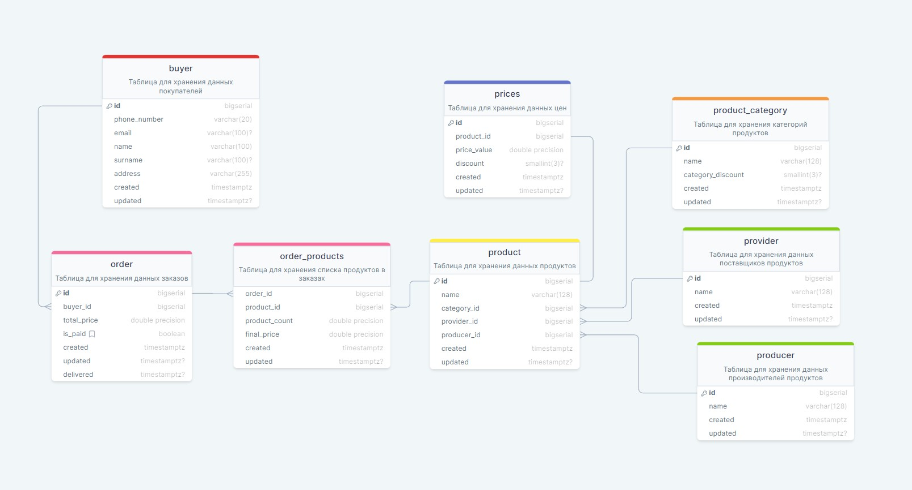

# Домашнее задание №1
``Реализуйте сущности продукты, категории продуктов, цены, поставщики, производители, покупатели и покупки``

Для выполнение задания использовался сервис [DrawSQL](https://drawsql.app/)

Сылка: [Проект](https://drawsql.app/teams/123-261/diagrams/shop-vol-1)

Схема:

### Возможные проблемы:
- Типы данных для полей с указанием скидки могут быть неправильно указаны (Тип данных специально для процентов не нашел)
- Типы данных для полей с указанием цены могут быть неправильно указаны (Не знаю какой тип с плавующей точкой лучше использовать)

## TODO
- [ ] Добавить комменты к колонкам