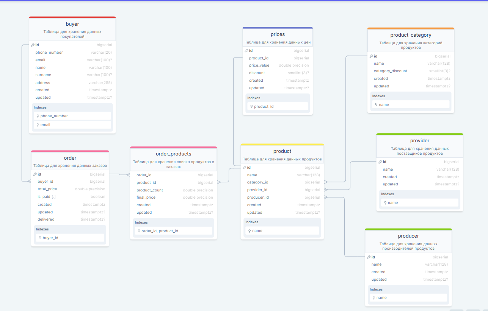

# Домашнее задание №2
``Добавляем в модель данных дополнительные индексы и ограничения``

Для выполнение задания использовался сервис [DrawSQL](https://drawsql.app/)

Сылка: [Проект](https://drawsql.app/teams/123-261/diagrams/shop-vol-2)

Схема:

### Возможные проблемы:
- Типы данных для полей с указанием скидки могут быть неправильно указаны (Тип данных специально для процентов не нашел)
- Типы данных для полей с указанием цены могут быть неправильно указаны (Не знаю какой тип с плавующей точкой лучше использовать)
- IntelliJ IDEA не поддерживает добавление комментариев к таблице (COMMENT ON...), поэтому могут быть ошибки синтаксиса