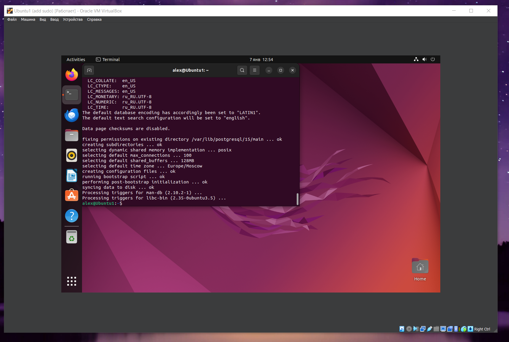
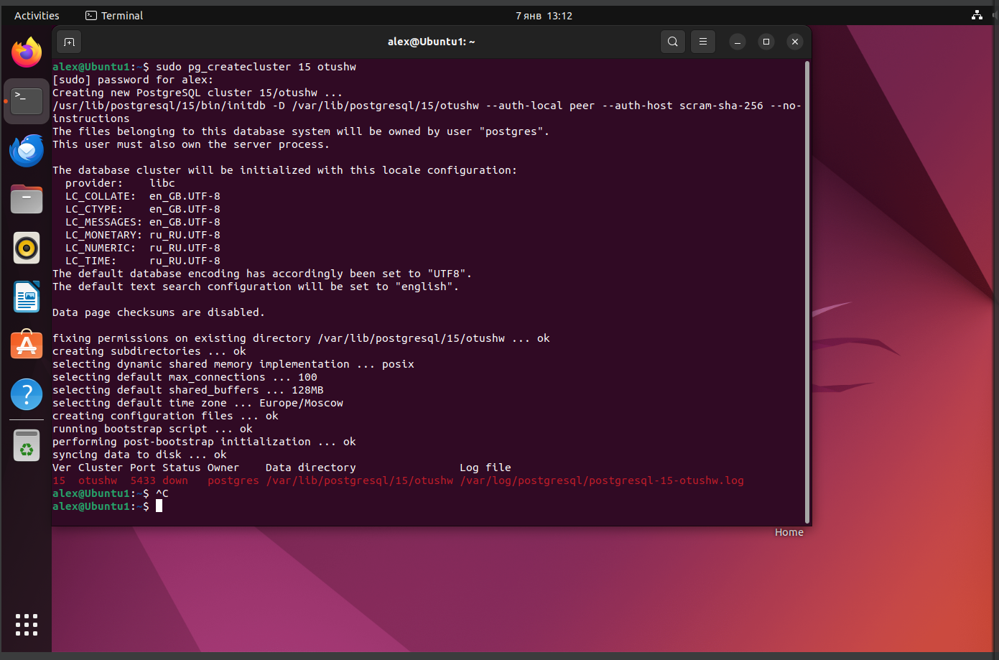
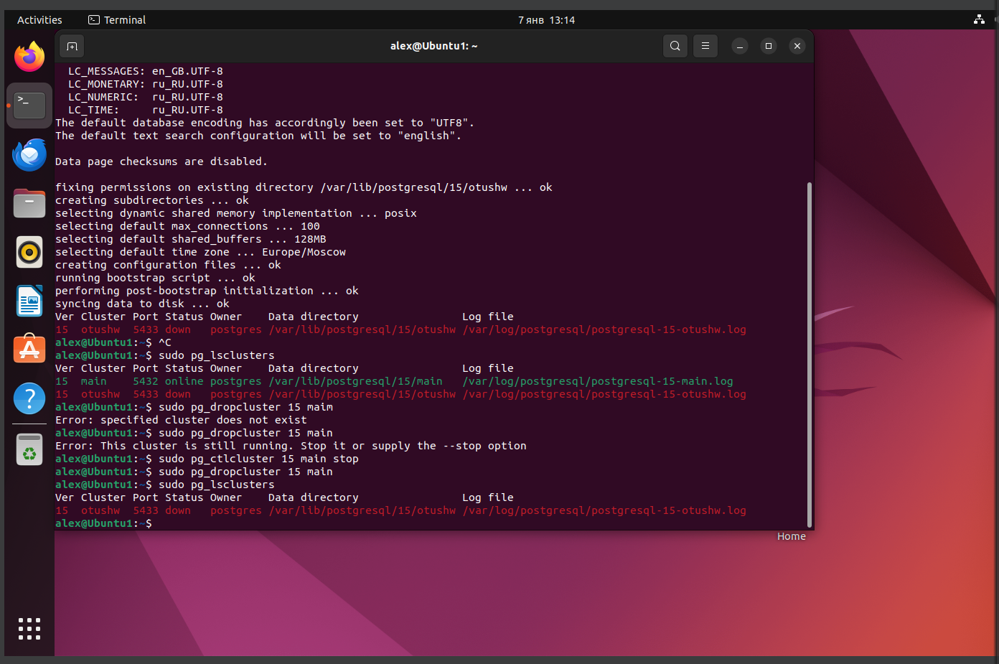
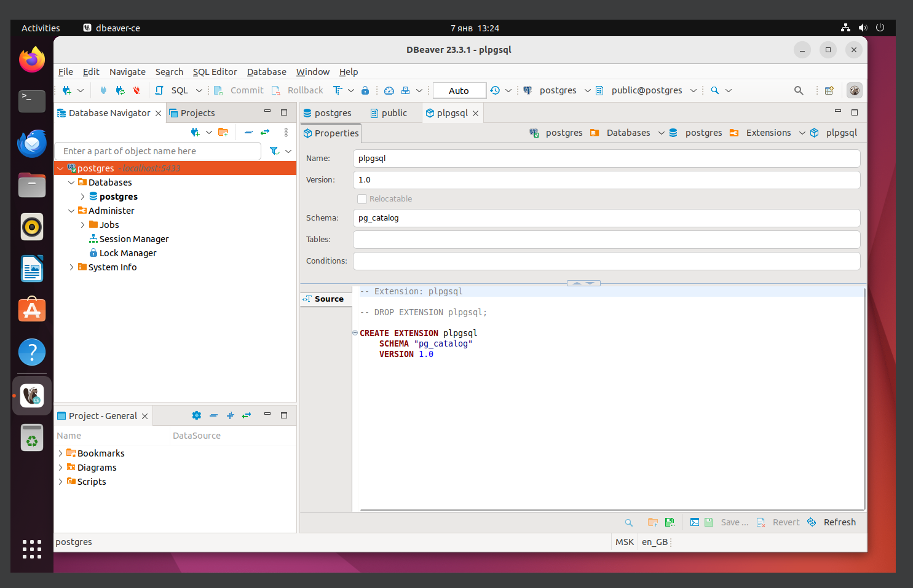

# Домашнее задание №2

- Развернуть контейнер с PostgreSQL или установить СУБД на виртуальную машину.
- Запустить сервер.
- Создать клиента с подключением к базе данных postgres через командную строку.
- Подключиться к серверу используя pgAdmin или другое аналогичное приложение.


Для выполнение задания использовалась программа [VM VirtualBox](https://www.oracle.com/virtualization/technologies/vm/downloads/virtualbox-downloads.html)

## Установка PostgreSQL:


Использовалась команда из самого первого занятия

```bash
sudo apt update && sudo apt upgrade -y && sudo sh -c 'echo "deb http://apt.postgresql.org/pub/repos/apt $(lsb_release -cs)-pgdg main" > /etc/apt/sources.list.d/pgdg.list' && wget --quiet -O - https://www.postgresql.org/media/keys/ACCC4CF8.asc | sudo apt-key add - && sudo apt-get update && sudo apt-get -y install postgresql-15
```

## Создание подключения и кластера:



## Создание подключения из DBeaver:

