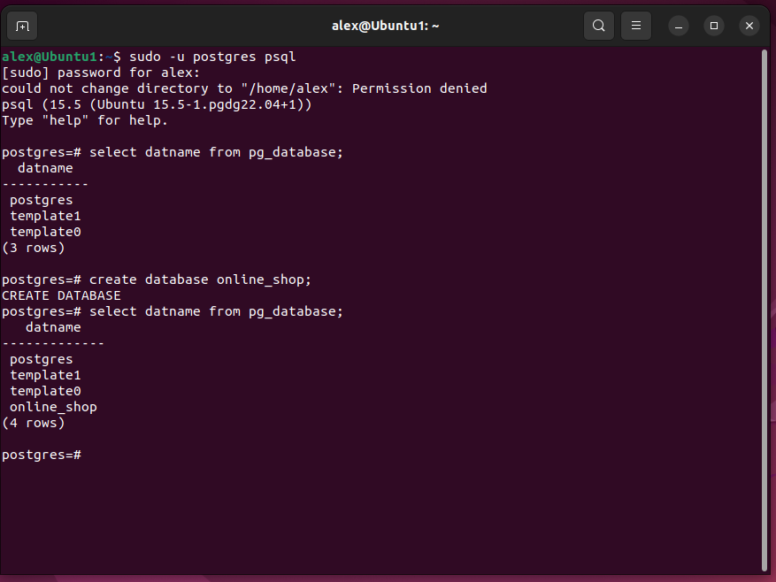
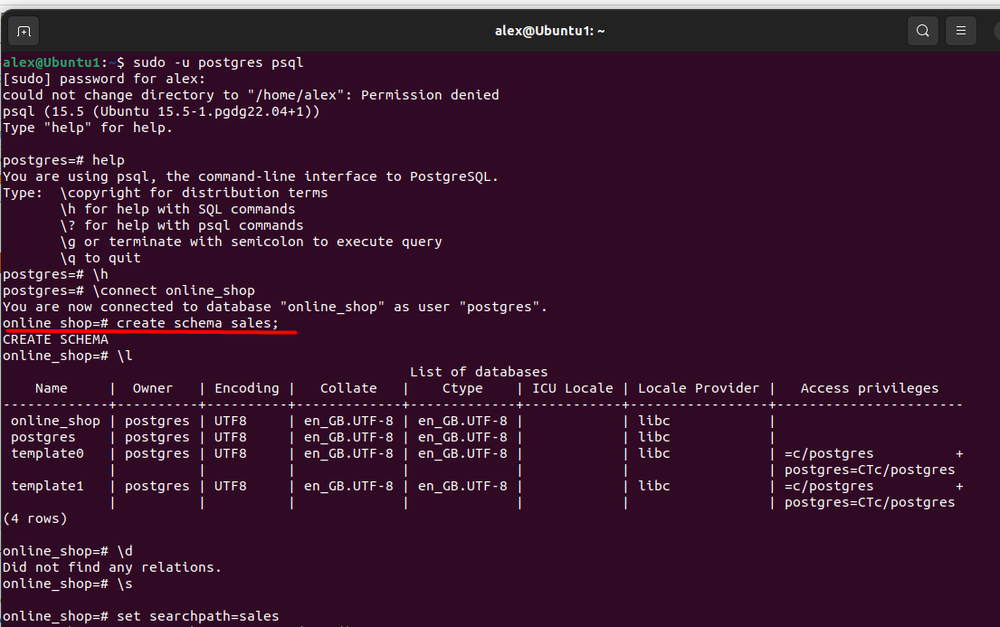
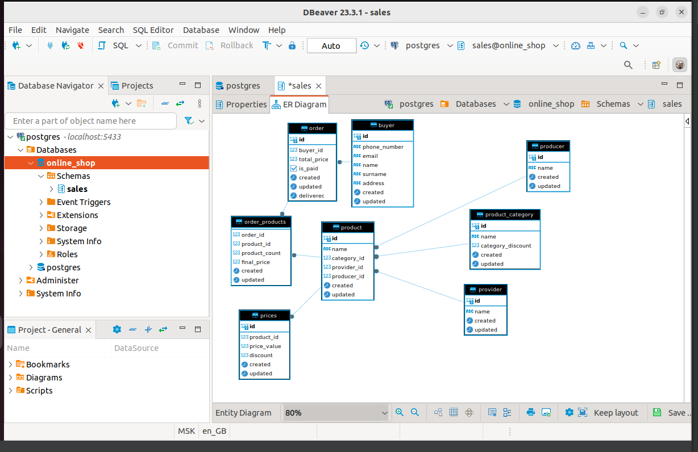

# Домашнее задание №4

1. Создайте базу данных.
2. Табличные пространства и роли.
3. Схему данных.
4. Таблицы своего проекта, распределив их по схемам и табличным пространствам.

Для выполнение задания использовалась программа [VM VirtualBox](https://www.oracle.com/virtualization/technologies/vm/downloads/virtualbox-downloads.html)

## Создание бд:

## Создание схемы:

## Создание таблиц:

Скрипт:

[pgsql-scheme.sql](pgsql-scheme.sql)

